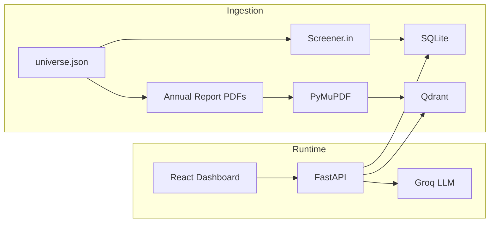

# Capital Screener + Memo Agent

Internal tool for screening 15–20 BSE-listed Indian SMEs, querying filings via RAG, and generating one-page investment memos.

## Live Demo

- **Dashboard:** https://frontend-snowy-two-ft3h1zkq8p.vercel.app
- **API:** https://capital-screener-api.onrender.com/api/health

Render free-tier APIs cold-start; the first request after idle can take ~30 seconds.

## Data honesty

The pipeline **tries Screener.in first**. If a scrape is blocked, returns empty tables, or maps revenue as 0, that company is filled from a **seed profile** derived from public BSE SME filings (approximate). Each company has a `data_source` of `real`, `hybrid`, or `seed`, shown in the dashboard.

Embeddings are **TF-IDF (384-d)**, not sentence-transformers — chosen to stay inside Render's RAM limits. The `EMBEDDING_MODEL` setting documents that choice.

Q&A and memos use Groq with a fallback model chain (`llama-3.1-8b-instant`, then larger models) so a single decommissioned model name does not 500 the demo.

## Architecture



## Quick Start (Local)

```bash
# Backend
cd backend
cp .env.example .env   # add GROQ_API_KEY
pip install -r requirements.txt
python -m ingest.main  # populate data/processed + Qdrant
uvicorn main:app --reload --port 8000

# Frontend (separate terminal)
cd frontend
npm install
npm run dev
```

Open http://localhost:5173

## Docker

```bash
export GROQ_API_KEY=your_key
docker compose up --build
```

- API: http://localhost:8000/docs
- Dashboard: http://localhost:5173

## API Endpoints

| Endpoint | Description |
|---|---|
| `GET /api/companies` | List/filter companies |
| `GET /api/companies/{id}` | Company detail + filings |
| `GET /api/companies/{id}/financials` | Time series for charts |
| `GET /api/ranking` | Explainable ranked list |
| `POST /api/companies/{id}/ask` | RAG Q&A with source citations |
| `POST /api/companies/{id}/memo` | Generate investment memo PDF |

## Ranking Logic

Transparent first-pass screen (not investment advice):

```
score = 0.40 × norm(growth) + 0.30 × norm(revenue) + 0.30 × risk_multiplier
```

Risk multipliers: LOW=1.0, MEDIUM=0.6, HIGH=0.2

Risk flags are rule-based:
- **HIGH:** negative growth, debt/equity > 2, or PAT margin declined 2+ years
- **MEDIUM:** growth 0–5% or debt/equity 1–2
- **LOW:** growth > 5% and debt/equity < 1

## Build vs Buy

| Decision | Options | Choice | Why |
|---|---|---|---|
| Vector store | Qdrant vs pgvector | **Qdrant** | Proven in ContractGuard; per-company metadata filtering; no Postgres extension on Render free tier |
| LLM | Groq vs OpenAI | **Groq** | Fast inference, generous free tier, sufficient for Q&A and memo drafts |
| Dashboard | Custom React vs Retool | **Custom React** | Full screening UX control; reuses ContractGuard patterns; no per-seat cost |
| Structured DB | Postgres vs SQLite | **SQLite** | 18-company universe fits file DB; zero infra; Postgres upgrade path documented |
| Data source | Mock vs real | **Screener first, seed fallback** | Live scrape is the happy path; committed JSON + seed profiles keep the demo up when Screener/BSE block CI |

## Data Refresh

GitHub Action (`.github/workflows/data_refresh.yml`) runs weekdays at 02:00 UTC or on manual dispatch. It re-scrapes Screener.in, downloads PDFs, and commits `data/processed/` artifacts.

## Project Structure

```
capital-screener/
├── backend/          # FastAPI + ingest pipeline
├── frontend/         # React dashboard
├── data/
│   ├── config/       # Company universe
│   └── processed/    # Committed structured JSON + chunk manifest
└── docker-compose.yml
```

## Deployment

### Render (Backend)

1. Connect GitHub repo
2. Use `render.yaml` blueprint
3. Set `GROQ_API_KEY` secret
4. Update `FRONTEND_URL` after Vercel deploy

### Vercel (Frontend)

1. Import repo, set **Root Directory** to `frontend/` (so `frontend/vercel.json` SPA rewrites apply)
2. Set env `VITE_API_URL=https://capital-screener-api.onrender.com`
3. Deploy

## License

MIT
